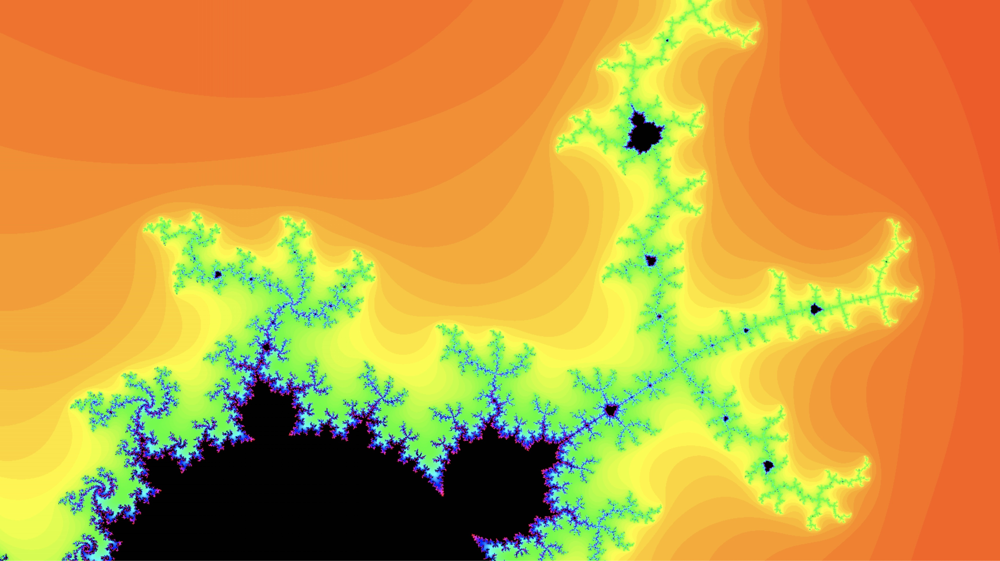

# Mandelbrot 🌌

## Introduction 🌟

The `mandelbrot` project is an interactive visualization of the Mandelbrot set, a renowned fractal known for its intricate and mesmerizing patterns. This application allows users to delve into different regions of the Mandelbrot set, offering a unique and captivating experience.

## Features 🚀

- **Interactive Visualization:** 🖼️ Pan and zoom to explore various areas of the Mandelbrot set.
- **Dynamic Coloring:** 🎨 Employing vibrant color schemes to showcase the fractal's complexity.
- **Floating Controls:** ⚙️ Real-time controls for adjusting parameters like zoom and pan.
- **Fractal View:** 🌀 (WIP) A dedicated view for exploring the famed different area of the Mandelbrot set.

## Planned Features 📅

- **Enhanced Performance:** ⚡ Optimizations for smoother zooming and panning.
- **Mobile Responsiveness:** 📱 Ensuring a seamless experience on various devices.
- **User-Defined Bookmarks:** 📌 Allowing users to save and revisit their favorite locations in the fractal.
- **Educational Mode:** 🎓 An informative guide to understanding fractals and the Mandelbrot set.

## Fractal Gallery 🖼️



## Installation 💾

Clone the repository and install dependencies:

```bash
git clone https://github.com/amalshehu/mandelbrot.git
cd mandelbrot
pnpm install
```

## Running the Application 🖥️

Start the application locally:

```bash
pnpm dev
```

Open `http://localhost:3000` in your browser to explore the Mandelbrot set.

## Usage 🛠️

- **Pan:** 🚶‍♂️ Click and drag or use arrow keys to navigate.
- **Zoom:** 🔍 Use the mouse wheel or zoom slider to adjust the view.

## License 📜

`mandelbrot` is open-source software under the [MIT License](LICENSE).
